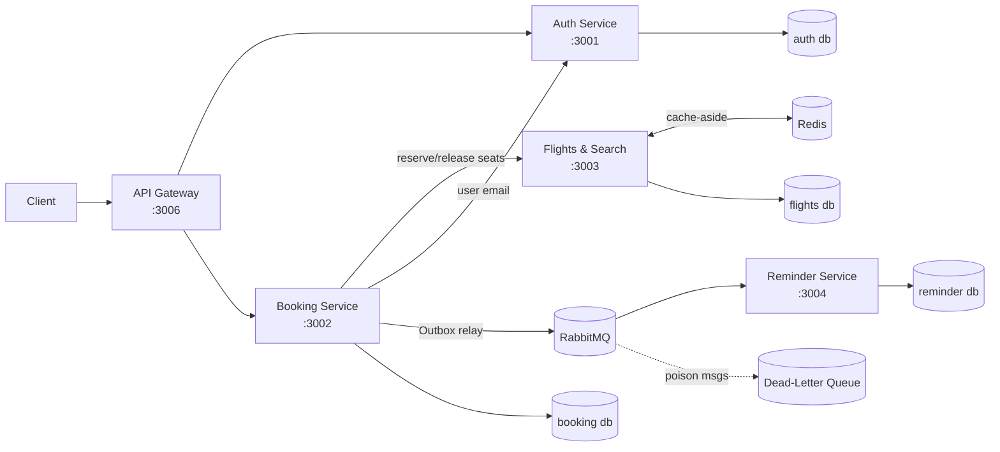

# ✈️ Airline Booking System — Microservices Backend

A production-oriented, event-driven airline booking backend built with **Node.js, Express, MySQL, RabbitMQ, and Redis**. It's designed to demonstrate how real systems handle the hard parts: **concurrency, distributed consistency, failure recovery, and scale** — not just CRUD.

> 📖 **[docs/ENGINEERING_JOURNAL.md](docs/ENGINEERING_JOURNAL.md)** documents every engineering challenge in this repo — the problem, the underlying concept, the fix, and interview-style Q&A. Start there to understand the *why* behind the code.

## 🏆 Engineering highlights

| Problem | Solution | Result |
|---|---|---|
| **Overselling** under concurrent bookings | Atomic conditional `UPDATE` (check-and-decrement in one statement) | **0 oversold** at 100 concurrent bookings (vs 95 with naive read-modify-write) |
| **No ACID transaction across services** | **Saga** with compensating transactions (reserve → book → auto-undo on failure) | Consistent state on partial failure; verified with a 409 + full rollback |
| **Double-booking on retry** | **Idempotency keys** with a UNIQUE constraint | Same key (even 5× concurrent) → exactly one booking |
| **Events lost on crash** (dual-write) | **Transactional Outbox** + background relay | At-least-once delivery; event written atomically with the booking |
| **Orphaned seat holds** after a crash | **Auto-expiry sweeper** (lease + reaper) | Self-healing; orphaned holds released automatically |
| **Messages lost / poison messages** | **Durable queues + persistent messages + Dead-Letter Queue** | Survive broker restart; poison messages parked in a DLQ |
| **Slow repeated searches** | **Redis cache-aside** + generation-counter invalidation | **p50 search latency 4.5× faster** (1523ms → 342ms) on 5k flights |

Plus: **Jest unit tests + GitHub Actions CI**, `/health` probes, **structured logging with correlation-ID tracing**, and **schema validation** at the edge.

## 🏛 Architecture



Each service owns its database (database-per-service). The **Booking Service** orchestrates the booking saga; the **Flights Service** owns seat inventory (the single source of truth for seat counts); the **Reminder Service** consumes booking events and sends notifications.

## 🛠 Tech Stack

- **Runtime:** Node.js + Express
- **Data:** MySQL + Sequelize (migrations as the schema source of truth)
- **Messaging:** RabbitMQ (durable exchange, DLQ)
- **Cache:** Redis (cache-aside)
- **Auth:** JWT + bcrypt
- **Observability:** pino structured logging + correlation IDs, `/health` probes
- **Testing/CI:** Jest, GitHub Actions

## 🚀 Quick Start

**Prerequisites:** Node.js 18+, MySQL, Docker (for RabbitMQ + Redis).

```bash
# 1. Start infrastructure (RabbitMQ + Redis)
docker compose up -d

# 2. Create databases + user, then per service:
cd <Service> && npm install
npx sequelize db:migrate --config src/config/config.json --models-path src/models --migrations-path src/migrations
npx sequelize db:seed:all  --config src/config/config.json --models-path src/models --seeders-path src/seeders

# 3. Run each service (separate terminals)
npm start   # in AuthService, FlightsAndSearchService, BookingService, ReminderService, API_Gateway
```

Databases: `auth_service_dev`, `booking_service_dev`, `flights_service_dev`, `reminder_service_dev`.
Service ports: Auth `3001` · Booking `3002` · Flights `3003` · Reminder `3004` · Gateway `3006`.

## 🧪 Tests & Benchmarks

```bash
# Unit tests (mock all I/O — no DB/broker needed)
cd BookingService && npm test
cd FlightsAndSearchService && npm test

# Prove no overselling under concurrency
node loadtest/seat-concurrency-test.js --mode=atomic --seats=5 --concurrency=100

# Benchmark cached vs uncached search (seed data first — see the SQL file)
mysql -u root -p flights_service_dev < loadtest/seed-bench-flights.sql
node loadtest/search-benchmark.js --n=3000 --concurrency=50
```

Captured results live in **[loadtest/RESULTS.md](loadtest/RESULTS.md)**.

## 📚 API (via the Gateway)

| Method | Endpoint | Description |
|---|---|---|
| `POST` | `/api/v1/signup` · `/signin` | Register / login (JWT) |
| `GET` | `/api/v1/flights` | Search flights (cached) |
| `POST` | `/api/v1/flights/:id/seats/reserve` | Atomic seat reservation |
| `POST` | `/api/v1/bookings` | Create a booking (idempotent; `Idempotency-Key` header) |
| `GET` | `/health` | Liveness/readiness (every service) |

## 📈 What I'd do next

Pagination for search, distributed tracing (OpenTelemetry/Jaeger), Prometheus + Grafana dashboards, centralized gateway auth, and least-privilege DB users. See the journal for details.

## 👤 Author

**[@khushalbansal02](https://github.com/khushalbansal02)** — [airline--backend-system](https://github.com/khushalbansal02/airline--backend-system)

## 📝 License

MIT
