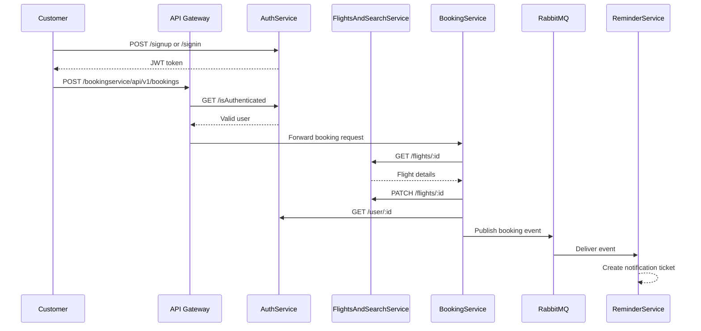
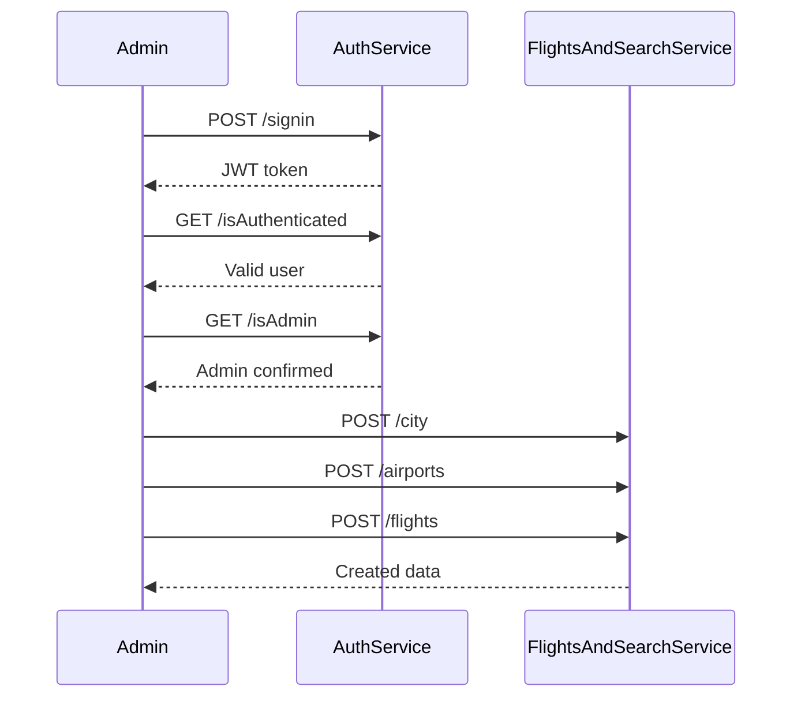

# Role-Based User Journey and API Coverage

This document describes the end-to-end journey for the two main roles in this project:
- Customer/User
- Admin

It also maps the APIs covered by these roles across the whole system.

---

## 1. Roles and Their Responsibilities

### Customer/User
A customer can:
- create an account or sign in
- authenticate with JWT
- search flights
- create a booking
- view their own profile information
- trigger the booking notification flow indirectly through booking creation

### Admin
An admin can:
- perform all customer actions
- verify admin access through the admin-check endpoint
- manage flight-related master data such as cities, airports, and flights
- inspect user information when needed
- use internal/admin-oriented service endpoints such as flight and city management

---

## 2. Customer/User Journey

### Step 1: Sign up or sign in
- Service: AuthService
- APIs:
  - `POST /api/v1/signup`
  - `POST /api/v1/signin`
- Purpose:
  - create a new account
  - receive a JWT token for authenticated requests
- Required headers:
  - `Content-Type: application/json`
- Request body for signup:
  ```json
  {
    "email": "customer@example.com",
    "password": "password123"
  }
  ```
- Request body for signin:
  ```json
  {
    "email": "customer@example.com",
    "password": "password123"
  }
  ```
- Expected success response:
  ```json
  {
    "success": true,
    "data": "<jwt_token>",
    "message": "successfully create the new user"
  }
  ```
- Validation notes:
  - email must be valid
  - password length must be at least 3 characters

### Step 2: Authenticate requests
- Service: AuthService
- API:
  - `GET /api/v1/isAuthenticated`
- Purpose:
  - validate the JWT passed through the gateway
- Required headers:
  - `x-access-token: <jwt_token>`
- Expected success response:
  ```json
  {
    "success": true,
    "data": 1,
    "message": "user is authenticated and token is valid"
  }
  ```
- This endpoint is used by the API Gateway before forwarding booking requests.

### Step 3: Search flights
- Service: FlightsAndSearchService
- APIs:
  - `GET /api/v1/flights`
  - `GET /api/v1/flights/:id`
  - `GET /api/v1/city`
  - `GET /api/v1/city/:id`
- Purpose:
  - view available flights
  - inspect flight details
  - read city and airport context
- Example search request:
  - `GET /api/v1/flights?departureAirportId=1&maxprice=1000`
- Example response:
  ```json
  [
    {
      "id": 1,
      "flightNumber": "AI101",
      "price": 500,
      "totalSeats": 300
    }
  ]
  ```
- Optional query parameters:
  - `departureAirportId`
  - `arrivalAirportId`
  - `minprice`
  - `maxprice`

### Step 4: Create a booking
- Entry point: API Gateway
- API:
  - `POST /bookingservice/api/v1/bookings`
- Required headers:
  - `Content-Type: application/json`
  - `x-access-token: <jwt_token>`
- Request body:
  ```json
  {
    "flightId": 1,
    "userId": 1,
    "noofSeats": 2
  }
  ```
- Gateway behavior:
  - validates the JWT by calling AuthService
  - forwards the request to BookingService
- Expected behavior:
  - BookingService checks flight availability
  - BookingService creates a booking record
  - BookingService updates flight seat availability
  - BookingService publishes a reminder event

### Step 5: Booking service processing
- Service: BookingService
- Internal calls:
  - `GET http://localhost:3003/api/v1/flights/:flightId`
  - `PATCH http://localhost:3003/api/v1/flights/:flightId`
  - `GET http://localhost:3001/api/v1/user/:userId`
- Purpose:
  - check flight availability
  - allocate seats
  - store booking info
  - publish a notification event
- Request payload details used by BookingService:
  - `flightId`: reference to an existing flight
  - `userId`: reference to the logged-in user
  - `noofSeats`: number of seats to reserve
- BookingService also relies on:
  - RabbitMQ exchange and routing key configuration
  - the flight service URL in environment variables

### Step 6: Reminder notification
- Service: ReminderService
- Internal flow:
  - consumes the RabbitMQ event
  - creates a reminder ticket
  - sends email when due
- Reminder ticket example:
  ```json
  {
    "subject": "Booking confirmed",
    "content": "Your flight has been booked successfully.",
    "recepientEmail": "customer@example.com",
    "status": "PENDING"
  }
  ```
- This service uses SMTP credentials defined in its environment file.

### Customer journey sequence


---

## 3. Admin Journey

### Step 1: Admin authentication
- Service: AuthService
- API:
  - `POST /api/v1/signin`
  - `GET /api/v1/isAuthenticated`
  - `GET /api/v1/isAdmin`
- Purpose:
  - authenticate the admin account
  - verify that the user has admin privileges

### Step 2: Create a city
- Service: FlightsAndSearchService
- API:
  - `POST /api/v1/city`
- Purpose:
  - create a new city master entry
- Required headers:
  - `Content-Type: application/json`
- Example request body:
  ```json
  {
    "name": "Bangalore"
  }
  ```
- Expected success response:
  ```json
  {
    "id": 1,
    "name": "Bangalore"
  }
  ```
- This endpoint is admin-only in practice and should be used only by an authenticated admin.

### Step 3: Create an airport
- Service: FlightsAndSearchService
- API:
  - `POST /api/v1/airports`
- Purpose:
  - add an airport linked to an existing city
- Required headers:
  - `Content-Type: application/json`
- Example request body:
  ```json
  {
    "name": "Kempegowda International Airport",
    "cityId": 1
  }
  ```
- Expected success response:
  ```json
  {
    "id": 1,
    "name": "Kempegowda International Airport",
    "cityId": 1
  }
  ```
- This endpoint depends on the city already existing in the database.

### Step 4: Create an airplane
- Service: FlightsAndSearchService
- API:
  - `POST /api/v1/airplanes`
- Purpose:
  - add a new airplane that can be used by future flights
- Required headers:
  - `Content-Type: application/json`
- Example request body:
  ```json
  {
    "modelNumber": "Boeing 797",
    "capacity": 378
  }
  ```
- Expected success response:
  ```json
  {
    "id": 1,
    "modelNumber": "Boeing 797",
    "capacity": 378
  }
  ```
- This endpoint creates the airplane master data used by flight creation.

### Step 5: Create a flight
- Service: FlightsAndSearchService
- API:
  - `POST /api/v1/flights`
- Purpose:
  - add a new flight using an airplane and airports
- Required headers:
  - `Content-Type: application/json`
- Example request body:
  ```json
  {
    "flightNumber": "AI101",
    "airplaneId": 1,
    "departureAirportId": 1,
    "arrivalAirportId": 2,
    "departureTime": "2025-12-01 10:00:00",
    "arrivalTime": "2025-12-01 13:00:00",
    "price": 500
  }
  ```
- Expected behavior:
  - middleware validates the date and time values
  - the service checks the airplane capacity
  - the flight is stored with total available seats derived from airplane capacity
  - the request body above is the payload used for flight creation; it does not include any seat-count field because the seat capacity is derived from the selected airplane
- This is one of the most important admin-only management flows.

### Step 6: Manage existing records
- Service: FlightsAndSearchService
- APIs:
  - `GET /api/v1/city`
  - `GET /api/v1/city/:id`
  - `PATCH /api/v1/city/:id`
  - `DELETE /api/v1/city/:id`
  - `GET /api/v1/flights`
  - `GET /api/v1/flights/:id`
  - `PATCH /api/v1/flights/:id`
  - `PATCH /api/v1/airplanes/:id`
- Purpose:
  - view, update, or remove created master data
- Example update body for a flight:
  ```json
  {
    "price": 550
  }
  ```
- Example update body for an airplane:
  ```json
  {
    "capacity": 400
  }
  ```
- Example update body for a city:
  ```json
  {
    "name": "New City Name"
  }
  ```
- These endpoints are typically used after initial setup to maintain the system data.

### Step 6: Review user information
- Service: AuthService
- API:
  - `GET /api/v1/user/:id`
- Purpose:
  - inspect user account details
- This endpoint is used by BookingService internally to resolve the booking user's email and other account information.

### Step 5: Review user information
- Service: AuthService
- API:
  - `GET /api/v1/user/:id`
- Purpose:
  - inspect user account details

### Admin journey sequence


---

## 4. API Coverage by Role

### Detailed endpoint notes
- `POST /api/v1/signup`: used by a new customer to register.
- `POST /api/v1/signin`: used by both customer and admin to obtain the JWT.
- `GET /api/v1/isAuthenticated`: validates the JWT and is called by the gateway.
- `GET /api/v1/isAdmin`: admin-only verification endpoint.
- `GET /api/v1/user/:id`: fetches user profile details; used by the booking flow internally.
- `POST /bookingservice/api/v1/bookings`: main booking action from the customer journey.
- `POST /api/v1/city`: admin flow for creating a city.
- `POST /api/v1/airports`: admin flow for creating an airport.
- `POST /api/v1/flights`: admin flow for creating a flight.
- `PATCH /api/v1/flights/:id`: admin flow for updating a flight.
- `POST /api/v1/tickets`: reminder service endpoint used to create reminder records.

| Area | Endpoint | Customer/User | Admin |
|---|---|---:|---:|
| Gateway | `GET /home` | Yes | Yes |
| Gateway | `POST /bookingservice/api/v1/bookings` | Yes | Yes |
| Auth | `POST /api/v1/signup` | Yes | Yes |
| Auth | `POST /api/v1/signin` | Yes | Yes |
| Auth | `GET /api/v1/isAuthenticated` | Yes | Yes |
| Auth | `GET /api/v1/isAdmin` | No | Yes |
| Auth | `GET /api/v1/user/:id` | Yes (own profile) | Yes |
| Booking | `POST /api/v1/bookings` | Yes | Yes |
| Booking | `POST /api/v1/publish` | No | Yes (internal/test) |
| Booking | `GET /api/v1/hi` | No | No (internal/test) |
| Flights | `POST /api/v1/city` | No | Yes |
| Flights | `GET /api/v1/city` | Yes | Yes |
| Flights | `GET /api/v1/city/:id` | Yes | Yes |
| Flights | `PATCH /api/v1/city/:id` | No | Yes |
| Flights | `DELETE /api/v1/city/:id` | No | Yes |
| Flights | `POST /api/v1/airports` | No | Yes |
| Flights | `POST /api/v1/flights` | No | Yes |
| Flights | `GET /api/v1/flights` | Yes | Yes |
| Flights | `GET /api/v1/flights/:id` | Yes | Yes |
| Flights | `PATCH /api/v1/flights/:id` | No | Yes |
| Reminder | `POST /api/v1/tickets` | No | No (internal/service-driven) |

---

## 5. End-to-End Summary

The complete journey across the project is:
1. A user or admin authenticates through AuthService.
2. A customer searches flights and creates a booking through the gateway.
3. BookingService validates the booking and updates flight inventory.
4. The booking event is published to RabbitMQ.
5. ReminderService consumes the event and creates notification work.
6. An admin can additionally manage cities, airports, flights, and verify admin access.
